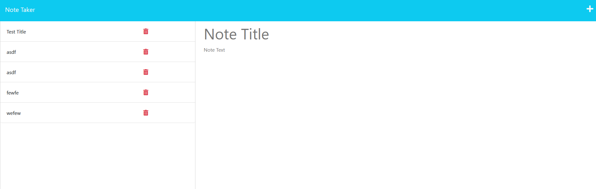

# Note Taker

## Description

This application allows one to take and review notes. In order to learn more about server routing and using express.js in general, this application was made. This application takes backend data and sends it to a frontend, then waits for any frontend input and saves that data to the backend in a simple json file. I learned a lot about modularization and how routing requests to other files keeps the original server file clean.

## Installation

N/A

## Usage

Please go on the [deployed heroku website](https://gentle-dawn-93521-92f7b10fa103.herokuapp.com/) to access this application. Click on the plus button and enter values in both the title and text boxes, then click the save icon to save your note. Click on other notes to view their contents. Deletion is not yet a feature. In theory, anyone can leave anything they want and everyone will see it. I am not responsible for what random people end up putting in the database, and will most likely just shut down the application if any bad actors are to show up since this is for educational purposes only.

## Credits
fsUtils.js was not created by me. I am not sure who made it.

Frontend was given, and therefore is not included in this repo.

## License
N/A
